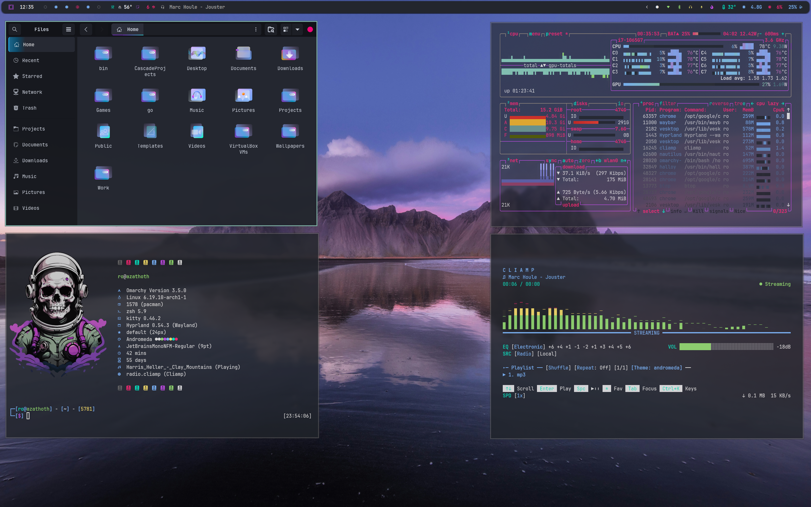

# Andromeda Inspired Theme

An Omarchy Theme for your Arch Linux / Hyprland setup based Andromeda. Recommend using the Andromea GTK-3.0/4.0 theme available on gnome-look.org as well as the waybar theme which is a modification of [HANCORE](https://github.com/HANCORE-linux)'s 'V2.1a' waybar theme. Waybar theme is found in the waybar-theme folder.

Waybar themes can be easily managed by '[Wayflipper](https://github.com/OldJobobo/wayflipper)' by OldJobobo

# Installation

To install this theme, simply use the ``omarchy-theme-install``   

command: `` omarchy-theme-install https://github.com/signaldirective/andromeda ``  

  

**Theme by Signal Directive**
**Additional Credits:** HANCORE for Waybar theme